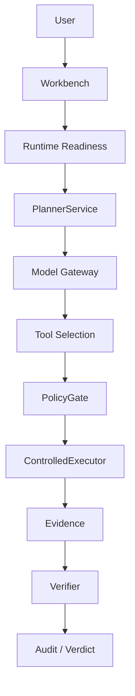

# CyberSecurity-Agent

一个面向网络安全任务、强调受控执行与可审计证据链的通用自主决策智能体。

## 项目简介

CyberSecurity-Agent 用于把网络安全任务组织为可约束、可验证、可追溯的执行流程。用户通过 Workbench 提交任务后，系统依次完成模型理解、PlannerService 规划、工具选择、PolicyGate 检查、ControlledExecutor 执行、Evidence 收集、Verifier 验证、Audit 留痕与 Verdict 输出。

```text
任务输入
→ 模型理解
→ PlannerService 规划
→ 工具选择
→ PolicyGate
→ ControlledExecutor
→ Evidence
→ Verifier
→ Audit
→ Verdict
```

Admin 和 Workbench 由 FastAPI 与 Uvicorn 提供本地服务。公开仓库不包含真实凭据、运行时数据库、私有场景或内部开发材料。

## 核心能力

- **真实模型接入**：通过 Model Gateway 接入 DeepSeek 及 OpenAI-compatible Provider，不使用模拟模型替代生产路径。
- **自主任务理解**：由真实模型解析任务目标、授权范围和输入材料。
- **智能规划**：PlannerService 根据任务和可用工具生成受约束的执行计划。
- **工具选择**：只从当前 TaskPack 注册并通过健康检查的工具中选择操作。
- **安全策略门禁**：PolicyGate 在执行前检查目标、参数与网络边界。
- **受控执行**：ControlledExecutor 将操作限制在明确的执行器和资源边界内。
- **证据与审计**：Evidence、Verifier 与 Audit 共同形成可复核的 Verdict；Runtime Snapshot 和 ModelCallRef 用于关联运行时身份与模型调用轨迹。
- **fail-closed**：模型、执行器或其他必要组件未就绪时，任务不会进入执行状态。

## 当前支持情况

| 能力 | 机器标识 | 当前状态 | 说明 |
|---|---|---|---|
| Source Audit | `source.audit.python` | `READY` | 当前正式可运行 TaskPack；仍需模型 Capability Probe 和执行器 readiness 通过。 |
| Web-IDOR | `web.idor` | `EXECUTOR_NOT_READY` | 已保留能力契约，但本公开版本没有正式可运行执行器。 |
| Report | `unavailable` | 尚未实现 | 当前不会生成正式 Report。 |
| Replan | `unavailable` | 尚未实现 | 当前没有完成 Replan 执行闭环。 |

## 系统架构



Runtime Readiness 是执行前的统一门禁。只有模型能力、正式 Runtime 组件和所选 TaskPack 执行器均满足要求时，Workbench 才允许提交任务。

## 快速开始

### 环境要求

- Windows 10 或更高版本
- Python 3.11、3.12 或 3.13
- [uv](https://docs.astral.sh/uv/)
- Windows Credential Manager，用于本地保存模型凭据

Docker 不是当前 Source Audit 启动的强制要求。`CYBER_AGENT_DOCKER_PATH` 仅为需要 Docker 的受控执行器预留。

### 安装依赖

在仓库目录打开 PowerShell：

```powershell
uv sync --dev --locked
```

`uv.lock` 已随公开仓库提供，正常安装时不应重新生成。

### 启动 Admin

```powershell
uv run python -m cyber_agent.server --admin
```

也可以在完成依赖安装后运行：

```powershell
start_admin.bat
```

`start_admin.bat` 只负责启动，不负责安装依赖，也不是一键部署工具。

### 配置模型

1. 打开 Admin。
2. 创建或选择模型 Profile。
3. 填写 Provider、Model 和 Endpoint。
4. 在本地输入自己的 API Key 并保存配置。
5. API Key 由服务端保存至 Windows Credential Manager。
6. 执行连接测试和 Capability Probe。
7. Probe 通过后，模型相关 Runtime readiness 才会进入可用状态。

不要把 API Key 写入仓库、README、`.env`、`.env.example`、YAML、测试、浏览器存储、日志或 SQLite 数据库。

公开环境变量示例只包含非 Secret 路径配置：

```text
CYBER_AGENT_RUNTIME_ROOT=
CYBER_AGENT_DOCKER_PATH=
```

如果设置 `CYBER_AGENT_RUNTIME_ROOT`，请把它放在仓库目录之外，因为其中可能包含数据库和运行时产物。

### 启动 Workbench

```powershell
uv run python -m cyber_agent.server --workbench
```

也可以在完成依赖安装后运行：

```powershell
start_workbench.bat
```

本地服务仅绑定 loopback 地址。启动器通过一次性交换地址建立本地认证会话。

## Source Audit 使用说明

Source Audit 面向用户明确授权的 Python 源码归档，基本流程如下：

```text
上传受控 ZIP
→ 输入任务
→ Runtime readiness
→ Agent Planning
→ Tool Selection
→ Controlled Analysis
→ Evidence
→ Verification
→ Verdict
```

执行前请确认归档内容属于授权分析范围。模型未配置、Capability Probe 未通过或 Source Audit 执行器不可用时，Runtime 会保持 fail-closed。

## 安全设计

- **Credential isolation**：API Key 只通过本地 Admin 提交，并由 Windows Credential Manager 保存。
- **fail-closed**：任何必要 readiness 失败都会阻止任务进入正式执行路径。
- **PolicyGate**：在工具执行前校验目标、参数和网络策略。
- **ControlledExecutor**：限制执行方式、资源范围和可用工具。
- **Secret boundary**：凭据不会写入仓库、SQLite、浏览器存储、日志或公开测试数据。
- **Evidence / Audit**：证据、验证结果与审计事件用于形成可复核输出。
- **无 Fake/Replay production fallback**：正式 Runtime 不会在模型或执行器不可用时静默切换到 Fake 或 Replay 结果。

仅可对自己拥有或已获得明确授权的系统与源码使用本项目。

## 测试

安装依赖后可运行公开测试：

```powershell
uv run pytest -p no:cacheprovider
```

公开发布验证结果：

```text
30 passed
```

公开测试覆盖 import、server startup、local session boundary、Runtime readiness、Source Audit 安全边界以及无 Fake/Replay production fallback。

## 当前限制

- Web-IDOR = `EXECUTOR_NOT_READY`
- Report 尚未实现
- Replan 尚未实现
- 当前版本为公开 Alpha 预览版
- 当前主要面向 Windows 环境；Linux 和 macOS 尚未完成同等级验证
- 当前提供源码快速启动，不提供复杂安装器或 portable deployment

## Release

当前公开版本为 `v0.1.0-alpha.1`，属于 Alpha 预览版本。

可前往 [GitHub Releases](https://github.com/MonkeyKing0227/CyberSecurity-Agent/releases) 下载已发布的 ZIP 和 checksum。Release ZIP 是对应 Tag 的不可变快照；`main` 上后续文档更新将在未来版本中进入新的 Release 资产。

## 安全与许可证

- 安全边界和漏洞报告说明：[SECURITY.md](SECURITY.md)
- 当前许可证状态：[LICENSE_PENDING.md](LICENSE_PENDING.md)

项目当前尚未确定最终开源许可证。代码公开可见不代表自动获得复制、修改、分发或商业使用许可。
